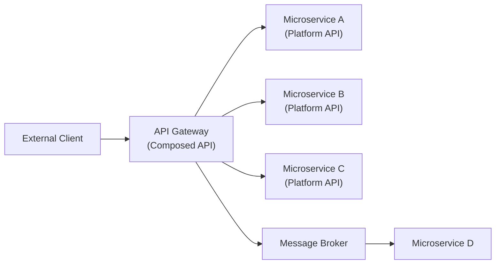

# API First Principles

**Category:** Design Philosophy
**Tags:** api-first, contract-first, taxonomy, composition, microservices, architecture

---

## Summary of Rules

- You **MUST** have an API for your service.
- You **MUST** use HTTP + JSON for any API that requires interoperability with clients outside your service perimeter.
- You **MUST** agree the contract you will expose **before writing any code** (contract-first / documentation-driven).
- You **MUST** consider whether an API that can serve multiple clients is viable before building an Application Specific API.
- You **MUST** use an anti-corruption layer to avoid coupling your API's resources to domain entities.
- You **SHOULD** choose your URI based on the assumption your API will eventually serve multiple clients, unless you are intentionally building an Application Specific API.
- You **SHOULD** make your contract externalisable. It **MAY NOT** be required immediately, but this capability **SHOULD** be possible from day one.
- You **SHOULD NOT** rely solely on an API Gateway to expose the externalisable contract. The contract **SHOULD** be directly externalisable from the microservice itself.
- You **SHOULD** consider using Event Carried State Transfer (messaging) to provide operand data before composing API calls.
- You **SHOULD** consider using Event Carried State Transfer (messaging) to build a composite view model before composing API calls.
- You **MAY** use [Pact](https://pact.io) to enforce that the contract is honoured.

---

## API Taxonomy

Use consistent terminology when discussing API types:

| Term | Definition |
|------|-----------|
| **Platform API** | An API exposed directly by a microservice. Represents self-contained business functionality. |
| **Gateway API** | A composed API that aggregates calls to two or more microservices. Lives in the API Gateway tier. |
| **Application Specific API** | An API tailored to a specific client application or partner. Not publicly documented. |
| **Backend for Frontend (BFF)** | An Application Specific API designed for a specific user-facing client (web, mobile, etc.). |
| **Backend for Integration (BFI)** | An Application Specific API designed for a specific B2B partner or integration. |

**Preference order:** Platform APIs > Gateway APIs > Application Specific APIs.

Platform APIs and Gateway APIs are publicly documented; third parties can build applications against them. Application Specific APIs are internal; they are not intended for third-party use.

---

## What is API First?

API First means:

1. **Every service exposes an API.** Functionality unreachable via API is effectively unusable — no website, mobile app, or CLI tool can consume it.
2. **Contract before code.** The API contract (OpenAPI spec) is agreed before any implementation begins. This is also called *Contract First* or *Documentation Driven* development.
3. **Externalisable by design.** Every contract is designed as if it could be published to external developers, even if it is not immediately required.

This philosophy was articulated by Jeff Bezos at Amazon: all teams must expose their data and functionality through service interfaces, and those interfaces must be designed as if they will be externalised to the outside world.

---

## API Quality Attributes

### Stable

A well-designed API has a single, clear concern. APIs with many reasons to change are volatile and expensive to evolve. Prefer APIs where data and functionality are well-partitioned and distinct.

### Usable

Design the API collaboratively with its consumers. The contract is a promise to clients; it must be agreed before implementation. Documentation must be complete enough for a client developer to build against the API before the server is implemented.

### Testable

A well-documented, contract-first, well-partitioned API is also highly testable. Consumer Driven Contract tools (e.g. [Pact](https://pact.io)) allow clients and servers to communicate their contractual obligations, enabling the contract to evolve safely.

---

## Anti-Corruption Layer

Do not couple your API resources directly to your domain entities. Avoid serialising domain objects directly into request or response bodies.

Instead, use an anti-corruption layer:

- Map incoming requests to internal commands or domain operations.
- Map domain entities to API response objects.

This allows you to evolve the implementation without breaking downstream consumers.

```
┌──────────────────────────────────────────────────────┐
│                   Microservice                       │
│                                                      │
│  HTTP Request → [Anti-Corruption Layer] → Domain     │
│  HTTP Response ← [Anti-Corruption Layer] ← Domain    │
└──────────────────────────────────────────────────────┘
```

---

## API Composition

When a single request requires data or actions from multiple microservices, you have two strategies.

### Server-Side Composition (Gateway API)

An API Gateway sits between the perimeter and your microservices. It mediates requests and can compose calls to multiple microservices into a single response.



**Benefits of Gateway composition:**
- Reduces round trips for the client (latency improvement for remote callers).
- Moves composition logic out of the client.
- Allows an HTTP API to compose internal protocols (e.g. messaging) not suitable for external exposure.
- Can provide service discovery, health checks, load balancing, TLS termination, authentication, and circuit breaking.
- Hides internal microservice partitioning from clients.

**Drawbacks of Gateway composition:**
- Requires building an additional API.
- Risk of "Entity Service" anti-pattern where CRUD logic bleeds into the Gateway.
- Ownership can become ambiguous — does the Gateway belong to the clients or to one of the microservices?

### Client-Side Composition

The client makes multiple direct calls to Platform APIs.

**Benefits:**
- No additional server API required.

**Drawbacks:**
- Composition logic must be duplicated across different clients/channels.
- Clients pay the latency cost of multiple round trips.
- Clients receive more data than needed if individual calls return full resources.

### When to Use Each

| Scenario | Recommendation |
|----------|---------------|
| Reducing client round trips is critical (mobile/web) | Server-side composition (Gateway) |
| Composition logic is complex and multi-step | Server-side composition |
| A single client needs tailored orchestration | Application Specific API / BFF |
| Simple data joining across 2–3 services | Consider Event Carried State Transfer first, then client composition |
| Query requires combining data from >2 services at high frequency | Server-side composition |

---

## API Gateway as Proxy

An API Gateway is also a proxy. It can centralise these cross-cutting concerns so individual microservices do not need to implement them:

- Service discovery and health checks
- Application load balancing
- Retry and circuit breaker logic
- TLS termination
- Authentication and authorisation
- Rate limiting and throttling

Centralising retry logic at the Gateway prevents "retry storms" where multiple services independently retry against a failing dependency.

---

## Application Specific APIs

An Application Specific API is tailored to a specific class of clients (a partner, a device type, etc.).

**Primary advantage:** The tailored solution fits client needs precisely.

**Primary disadvantage:** Proliferation of such APIs significantly increases maintenance cost.

Application Specific APIs:
- Are NOT publicly documented.
- Are intended for use by your own applications, not third parties.
- MUST have their URI prefixed with `/applications/{application}` (see URI Design).

---

## Pragmatic API First

When building a new capability that initially targets a single application:

- If the capability is not inherently application-specific (i.e., it is temporarily single-use, not permanently so), treat it as a Platform API from the start.
- Specify the contract and URIs as if you will eventually own a multi-client Platform API.
- A suite of re-usable but imperfect Platform APIs is preferable to a bloated estate of Application Specific ones.
