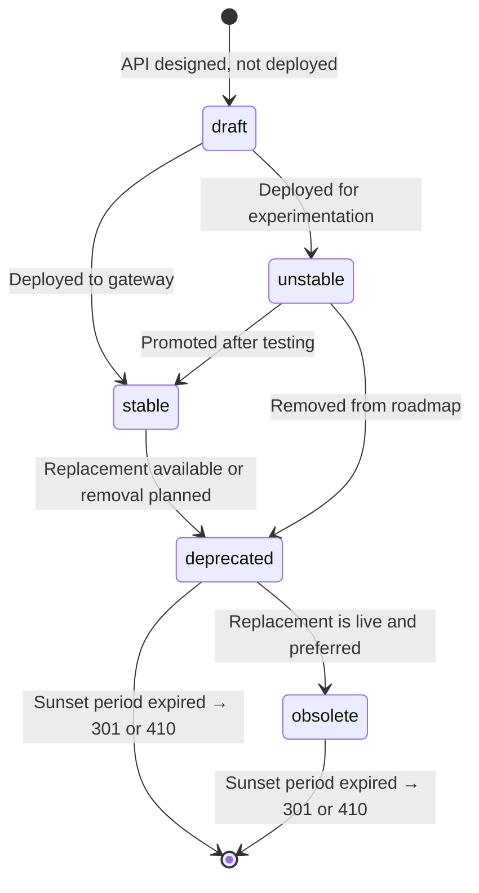

# API Lifecycle & Status

**Category:** Governance
**Tags:** lifecycle, status, draft, stable, deprecated, obsolete, openapi, x-status

---

## Summary of Rules

- You **MUST** indicate the status of the API in the OpenAPI documentation using one of the defined statuses: `draft`, `stable`, `unstable`, `deprecated`, or `obsolete`.
- The `x-status` extension field **SHOULD** be used in OpenAPI specs to declare status.
- An API without an explicit `x-status` field **SHOULD** be considered `stable` by default.
- The OpenAPI `deprecated` flag on an Operation Object **MUST** be set to `true` when deprecating a specific operation.
- When deprecating a parameter or schema object only, deprecation **MAY** be applied at that level rather than the operation level.
- When deprecating an entire API, the `x-status` field **MAY** be set at the Info Object level with value `deprecated` or `obsolete`.
- The API documentation **MUST** clearly state when an endpoint is in the experimental (`unstable`) phase so consuming teams understand the risk of using it.

---

## API Status Definitions

| Status | Meaning | When to Use |
|--------|---------|------------|
| `draft` | The API design has been proposed but the API is not yet available for clients to use. | When submitting a new API design that has not yet been deployed. |
| `stable` | The API is available for clients to use in production. | Once the API is deployed and available for consumption. |
| `unstable` | The API is available but may change, be intermittently unavailable, or be removed without notice. Clients use it at their own risk. | During testing or experimentation with a new API. |
| `deprecated` | The API is still available but will no longer be developed or supported, and may be discontinued soon. | When you intend to remove an API and want to discourage new adoption. |
| `obsolete` | A better alternative is available; this API is now redundant and will be discontinued. | When a replacement exists. Always document the replacement in comments. |

---

## API Lifecycle Flow



---

## OpenAPI Implementation

### Declaring Status at the Info Object Level

Use the `x-status` extension in the OpenAPI Info Object:

```yaml
info:
  title: My API
  version: "1.0"
  x-status: stable
```

Valid values: `draft`, `stable`, `unstable`, `deprecated`, `obsolete`.

### Deprecating an Operation

Set `deprecated: true` on the Operation Object:

```yaml
/customers/{customerId}:
  get:
    summary: Get customer
    deprecated: true
    description: "Deprecated: use GET /v2/customers/{customerId} instead."
```

### Deprecating a Parameter

Apply `deprecated: true` at the parameter level:

```yaml
parameters:
  - name: legacyFilter
    in: query
    deprecated: true
    description: "Deprecated: use the `filter` parameter instead."
```

### Deprecating an Entire API

Set `x-status` at the Info Object level and optionally mark all operations:

```yaml
info:
  title: Legacy Orders API
  version: "1.0"
  x-status: deprecated
  description: "This API is deprecated. Use the Orders API v2."
```

---

## Status Detection Helper

A platform helper of the form `x-status: {{ status() }}` can automatically derive status based on deployment context:

- If the API is **not deployed to the gateway**: status is `draft`
- If the API **is deployed to the gateway**: status defaults to `stable`

This is a platform-specific feature; when not available, status must be declared manually.

---

## Advantages and Considerations

**Advantage — Single Source of Truth:** Embedding status in the OpenAPI spec keeps all API information in one place, avoiding divergence between documentation and actual deployment state.

**Advantage — Granular Control:** Deprecating at the operation or parameter level allows precise signalling without marking the entire API as deprecated.

**Consideration — Tooling Enforcement:** As `x-status` is a specification extension (not a standard OpenAPI field), off-the-shelf tooling will not enforce its presence. Linting rules or CI checks should validate that the field is present on all API specs.

---

## Relationship to Versioning

API lifecycle status is distinct from versioning:

- **Status** describes the availability and supportability of the current API contract.
- **Versioning** manages breaking changes to the API contract over time.

An API can be `stable` at version 1 and `deprecated` at version 1 while version 2 is `stable`. See [API Versioning](./03-api-versioning.md) for the full deprecation and sunset process.
