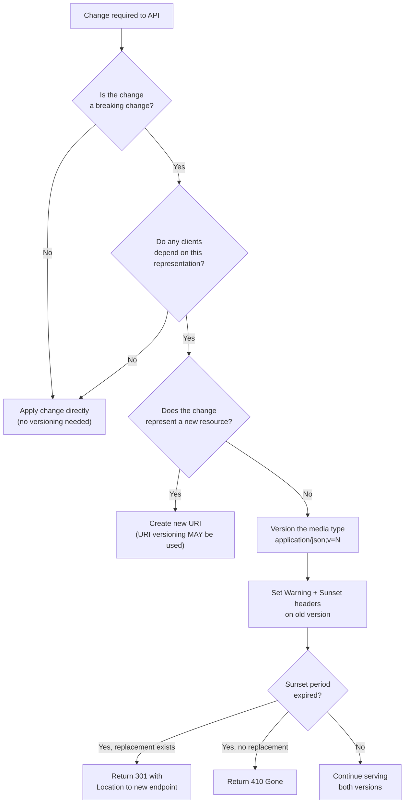

# API Versioning

**Category:** Design
**Tags:** versioning, breaking-change, tolerant-reader, content-negotiation, deprecation, sunset, backward-compatibility

---

## Summary of Rules

- A client **MUST** be a [tolerant reader](#tolerant-reader).
- A server making a **non-breaking change** to a representation **MUST NOT** version the representation — unnecessary versioning increases maintenance complexity.
- A server making a **breaking change** to a representation that clients depend on **MUST** version the representation to support older clients.
- A server making a breaking change to a representation that **no client depends on** **MUST** treat it as a non-breaking change.
- When versioning a representation (not a new resource), **content-type negotiation** of the form `content-type;v=MAJOR` **MUST** be used. For example: `application/json;v=1` or `text/plain;v=1`. `MAJOR` has the same meaning as in [Semantic Versioning](https://semver.org/).
- A server **MUST** return a `Vary: Accept` header if it can return multiple versions of a response alongside a `Cache-Control` header. This prevents an intermediary cache from overwriting a previously cached version.
- An API spec **MUST** indicate its current accurate API status (see [API Lifecycle](./02-api-lifecycle.md)).
- An engineer **MUST** document the most recent or actively targeted version of the contract.
- A server **SHOULD** allow clients to use the `Accept` header for content-type negotiation.
- A server **SHOULD NOT** use custom vendor media types for versioning (e.g. `application/vnd.myapi.v1+json`) as they require extra registration and configuration.
- A server **SHOULD** assume the first version as default if the `Accept` header does not indicate a version.
- A server **SHOULD** ensure changes are backward compatible to minimise breaking changes.
- A server **SHOULD** return `301 Moved Permanently` or `410 Gone` once the sunset period has expired.
- Engineers **SHOULD** document all currently supported versions of the contract.
- A server **MAY** use a new URI if forced into a breaking change that reflects a genuinely new resource (rather than a changed representation).

---

## Key Concepts

### Resource

An entity (or collection of entities) whose identity is given by a URI, and whose schema or representation is given by a media type. The version of the entity is given by an `ETag` or `Last-Modified` timestamp.

### Breaking Change

A breaking change to a representation is one that results in a new representation that clients cannot process.

Not all changes are breaking. A change is only breaking if clients cannot tolerate it. Clients that are not tolerant readers are at risk of breaking on non-breaking changes.

### Tolerant Reader

> Tolerant Readers extract only what is needed from a message and ignore the rest. Rather than implementing a strict validation scheme, they make every attempt to continue with message processing when potential schema violations are detected. Exceptions are only thrown when the message structure prevents the reader from continuing, or the content clearly violates business rules. Tolerant Readers ignore new message items, the absence of optional items, and unexpected data values as long as this information does not provide critical input to the service logic.
>
> — *Daigneau, Rob. Service Design Patterns*

---

## Breaking vs Non-Breaking Changes

| Change | Tolerant (non-breaking) | Intolerant (breaking) |
|--------|------------------------|-----------------------|
| Adding a property | ✅ Tolerant | |
| Adding a value to an enum on a **request** | ✅ Tolerant | |
| Removing a value from an enum on a **response** | ✅ Tolerant | |
| Removing a property | | ❌ Breaking |
| Changing a property name | | ❌ Breaking |
| Changing a property type | | ❌ Breaking |
| Removing a value from an enum on a **request** | | ❌ Breaking |
| Adding a value to an enum on a **response** | | ❌ Breaking |
| Changing a representation's URI | | ❌ Breaking |

If a server makes a change that a client is expected to be intolerant to, that change **MUST** be considered a breaking change.

---

## Versioning Strategies

### Preferred: Content-Type Negotiation

Version the media type, not the URI. The resource identity (URI) remains stable.

**Client sends:**
```
GET /customers/123 HTTP/1.1
Accept: application/json;v=2
```

**Server responds:**
```
HTTP/1.1 200 OK
Content-Type: application/json;v=2
Vary: Accept
```

**Rules:**
- Client sends `Accept` header on GET/HEAD/OPTIONS to indicate which version it understands.
- Client sends `Content-Type` header on POST/PUT/PATCH/DELETE to indicate the version of the request body.
- Server sends `Content-Type` header to indicate the version of the response.
- If client sends an older version in `Content-Type` but no `Accept`, the server **SHOULD** process and return the current version.
- If client sends only `application/json` (no version), the server **SHOULD** assume the client wants the latest version.

**Advantages:**
- Client-driven: clients declare what they can handle; the server reacts.
- Resource identity (URI) remains consistent across versions.
- Allows clients at different adoption rates to co-exist.

**Disadvantages:**
- Framework support for content-type negotiation varies; some frameworks require additional packages or configuration.

### Alternative: URI Versioning

Modify the URI when making a breaking change that results in a genuinely new resource.

```
https://api.example.com/v2/customers
```

**Advantages:**
- Out-of-the-box support in most HTTP frameworks.
- Well understood by most developers.

**Disadvantages:**
- Alters the resource identity, forcing clients to update stored references.
- Requires fanout — all URIs in the API must be versioned, not just the changed resource.

URI versioning **SHOULD** only be used when the breaking change represents a genuinely new resource, not merely a changed representation.

### Alternative: Custom Header Versioning

Pass the version in a custom request header:

```
GET /customers/123 HTTP/1.1
x-version: 2
```

**Advantages:**
- URI remains stable.

**Disadvantages:**
- Some reverse proxies strip non-standard headers.

### Alternative: Redirect Versioning

Redirect clients from an unversioned URI to a versioned one:

```
GET /customers HTTP/1.1
→ 301 Moved Permanently
   Location: https://api.example.com/v2/customers
```

**Disadvantages:**
- Not all HTTP clients follow redirects automatically.

---

## Documenting Multiple Versions in OpenAPI

Use separate media type entries under the `content` property:

```yaml
responses:
  '200':
    content:
      application/json;v=1:
        schema:
          $ref: '#/components/schemas/CustomerV1'
      application/json;v=2:
        schema:
          $ref: '#/components/schemas/CustomerV2'
```

---

## Deprecation Process

When a resource or version must be deprecated, implement as many of the following as practically possible.

### Step 1: Set Deprecation Headers

All responses from the deprecated endpoint **MUST** include:

```http
Warning: 299 - "This resource is deprecated and will be removed on 2025-12-31."
Sunset: Tue, 31 Dec 2025 23:59:59 GMT
Link: </v2/customers>; rel="successor-version"
Link: <https://developer.example.com/api/deprecation-policy>; rel="sunset"
```

- `Warning` ([RFC 7234 §5.5](https://tools.ietf.org/html/rfc7234#section-5.5)): Brief human-readable deprecation note.
- `Sunset` ([RFC 8594](https://tools.ietf.org/html/rfc8594)): IMF-format timestamp of end-of-life.
- `Link`: May appear multiple times — link to the replacement resource and/or sunset policy documentation.

**Client guidance:** Clients **SHOULD** inspect `Warning` and `Sunset` headers and log them to aid discovery of deprecated usage.

### Step 2: Communicate

API maintainers **MUST** make a reasonable effort to communicate deprecation through available channels:

- Team messaging channels (Slack, Teams, etc.)
- Email to registered consumers (using client_id or similar claims to identify registered clients)
- API documentation / developer portal notice board

### Step 3: After End-of-Life

Once the sunset period has expired:

| Situation | Response |
|-----------|---------|
| Replacement resource exists | **MUST** return `301 Moved Permanently` with `Location` header pointing to new endpoint |
| No replacement exists | **MUST** return `410 Gone` |

**Note:** Keeping the empty endpoint in code is required for this to work, which has a maintenance cost. However, it significantly aids discovery of replacements for API consumers.

### Shortened Sunset Period

If all consumers are known (e.g. via consumer-driven contract testing), the sunset period **MAY** be shortened or eliminated with agreement from all consumers.

---

## Versioning Decision Flow


