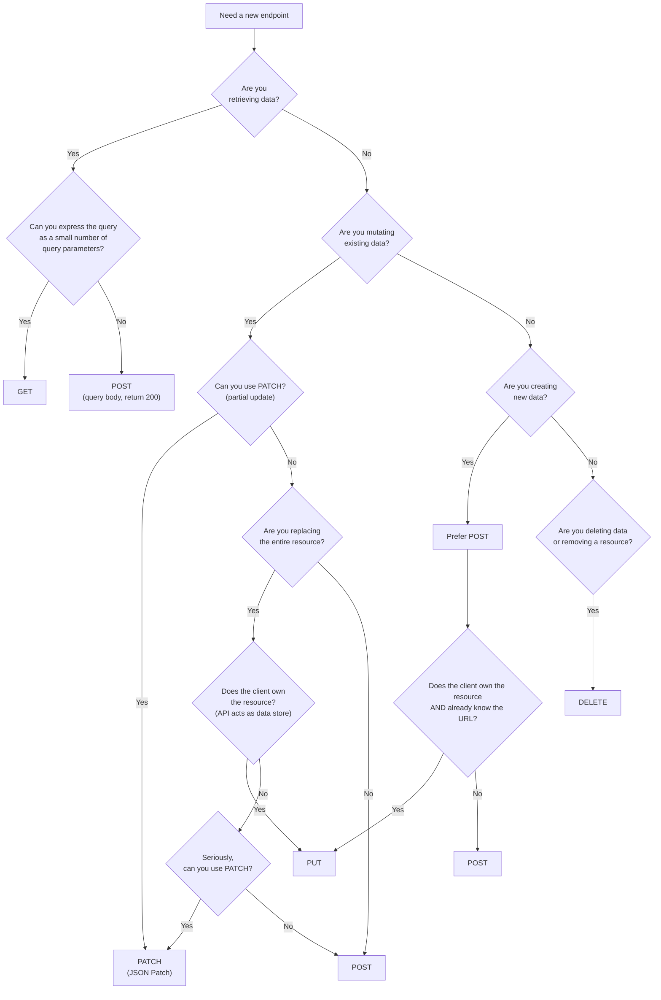

# HTTP Verbs

**Category:** Design
**Tags:** http-methods, GET, POST, PUT, PATCH, DELETE, idempotence, json-patch, safety

---

## Summary of Rules

- You **MUST** limit yourself to GET, POST, PUT, PATCH, and DELETE methods.
- Safety and idempotence rules for HTTP methods **MUST** always be respected.
- You **MUST** use the PATCH verb to update part of a resource.
- If you use the PATCH verb, you **MUST** use [JSON Patch](https://jsonpatch.com/) format ([RFC 6902](https://tools.ietf.org/html/rfc6902)).
- You **MUST** use the POST verb if a resource will be created or updated **after** the response is returned (asynchronous).
- You **MUST NOT** use the PUT verb if you cannot guarantee idempotence.
- You **MUST** return equivalent representations of a resource for GET and PUT requests to the same resource.
- GET requests **SHOULD NOT** change state; they should be safe and idempotent.
- A server **SHOULD** implement PATCH to allow clients to modify a resource without replacing it completely.
- Prefer `PATCH /resources/{resourceId}` over `POST /resources/{resourceId}/change-something`.
- Think carefully before exposing DELETE publicly. You **MAY** soft-delete resources and return `410 Gone` for subsequent access attempts.
- You **MAY** use PUT if a resource will be created or updated at the time the request is processed (synchronous).

---

## Method Properties

| Method | Safe | Idempotent | Has Request Body | Typical Response |
|--------|------|------------|-----------------|-----------------|
| GET | ✅ Yes | ✅ Yes | No | 200 with body |
| POST | No | No | Yes | 201 (create) / 202 (async) |
| PUT | No | ✅ Yes (must guarantee) | Yes | 200 or 204 |
| PATCH | No | No (unless implemented idempotently) | Yes (JSON Patch) | 200 or 204 |
| DELETE | No | ✅ Yes | No | 204 or 200 |

- **Safe**: The method does not change server state.
- **Idempotent**: Calling the method once or N times produces the same server state.

---

## HTTP Verb Decision Guide

Use this flowchart to choose the correct HTTP method for a new endpoint:



---

## GET

GET is for retrieving data. It **MUST NOT** change server state.

```http
GET /customers/123 HTTP/1.1
Accept: application/json
```

```http
HTTP/1.1 200 OK
Content-Type: application/json

{ "id": "123", "name": "Acme Corp" }
```

**Rules:**
- **MUST NOT** have side effects.
- **MUST** be safe and idempotent.
- When a query is too complex to express as query parameters, use POST with a request body that returns `200 OK`.

---

## POST

POST is used to create a resource or submit data for processing.

**Synchronous creation:**
```http
POST /customers HTTP/1.1
Content-Type: application/json

{ "name": "Acme Corp" }
```
```http
HTTP/1.1 201 Created
Location: /customers/123
```

**Asynchronous operation:**
```http
POST /bulk-import HTTP/1.1
Content-Type: application/json

{ ... }
```
```http
HTTP/1.1 202 Accepted
Location: /bulk-import/status/456
```

**POST for complex queries:**
```http
POST /customers/search HTTP/1.1
Content-Type: application/json

{ "filter": { "country": "DE", "status": "active" } }
```
```http
HTTP/1.1 200 OK
Content-Type: application/json

{ "data": [...] }
```

---

## PUT

PUT replaces an **entire** resource. Because it replaces the complete resource, it is difficult to evolve APIs that use PUT — adding a new property means existing clients would inadvertently erase it on the next PUT.

**Use PUT only when:**
- The client owns the resource (the service is acting as a data store).
- You can guarantee idempotence.
- The resource state is fully determined by the client's representation.

```http
PUT /wikis/pages/getting-started HTTP/1.1
Content-Type: application/json

{ "title": "Getting Started", "content": "..." }
```

**Idempotence guarantee examples:**

```gherkin
# NOT idempotent — avoid PUT
Given I PUT a Customer
And I publish a CustomerChanged event to external subscribers
Then calling PUT again causes an additional event emission
# Therefore: use POST or PATCH instead

# Idempotent — PUT is acceptable
Given I PUT a Customer
And the customer state is identical to what already exists
And no events are published
Then calling PUT again has no additional effect
```

**PUT and GET consistency:** A successful PUT **MUST** result in a subsequent GET returning an equivalent representation (RFC 7231 §4.3.4).

---

## PATCH

PATCH is for **partial updates**. It applies a set of changes to a resource, rather than replacing the whole resource.

PATCH **MUST** use [JSON Patch](https://jsonpatch.com/) format ([RFC 6902](https://tools.ietf.org/html/rfc6902)).

```http
PATCH /customers/123 HTTP/1.1
Content-Type: application/json-patch+json

[
  { "op": "replace", "path": "/name", "value": "New Name" },
  { "op": "replace", "path": "/address/city", "value": "Berlin" }
]
```

**Why PATCH over POST to an action-resource:**

Using `POST /customers/123/change-name` is an anti-pattern because:
- Partial changes are not possible — clients must send the whole compound field (e.g., the full name object) even to change just the first name.
- Multiple property changes require multiple requests.

Using `PATCH /customers/123` with JSON Patch allows changing any combination of fields in a single request.

**JSON Patch operations:**

| Op | Description | Example |
|----|-------------|---------|
| `add` | Add a value | `{ "op": "add", "path": "/tags/-", "value": "vip" }` |
| `remove` | Remove a value | `{ "op": "remove", "path": "/nickname" }` |
| `replace` | Replace a value | `{ "op": "replace", "path": "/name", "value": "Jane" }` |
| `move` | Move a value | `{ "op": "move", "from": "/old", "path": "/new" }` |
| `copy` | Copy a value | `{ "op": "copy", "from": "/src", "path": "/dst" }` |
| `test` | Assert a value (for conditional patches) | `{ "op": "test", "path": "/version", "value": 3 }` |

---

## DELETE

DELETE removes a resource.

```http
DELETE /customers/123 HTTP/1.1
```

```http
HTTP/1.1 204 No Content
```

**Soft delete consideration:** Before exposing DELETE publicly, consider whether a soft delete is more appropriate. After a soft delete, return `410 Gone` for subsequent requests to that URI. This allows the resource to be reinstated if needed and provides a better consumer experience than a hard-to-diagnose 404.

---

## PUT vs PATCH vs POST: Decision Summary

| Scenario | Recommended Method |
|----------|-------------------|
| Create a resource (server assigns ID) | POST |
| Create a resource (client specifies URL, API is a data store) | PUT |
| Replace an entire resource | PUT (only if idempotent) |
| Update one or more fields of a resource | PATCH (JSON Patch) |
| Trigger an asynchronous operation | POST |
| Query with a complex filter | POST (returns 200) |
| Delete a resource | DELETE |
