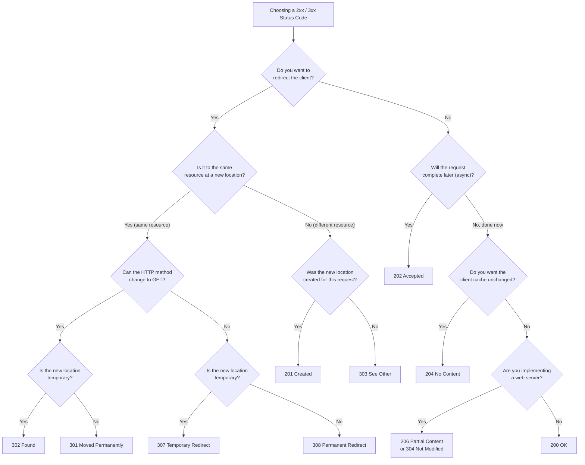
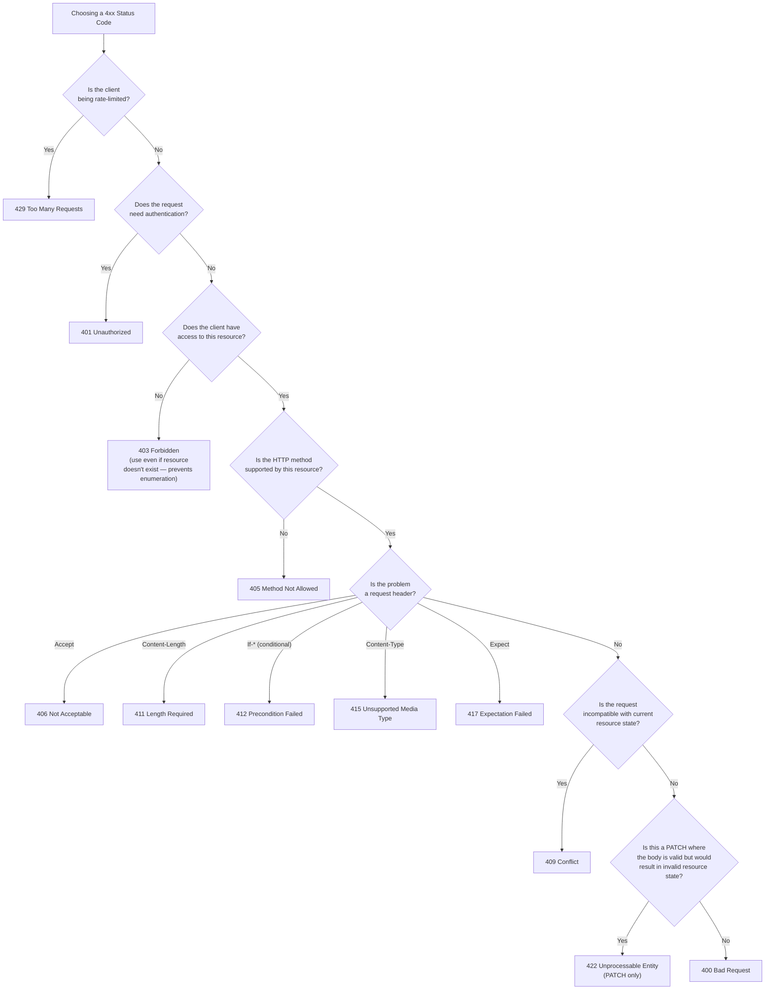
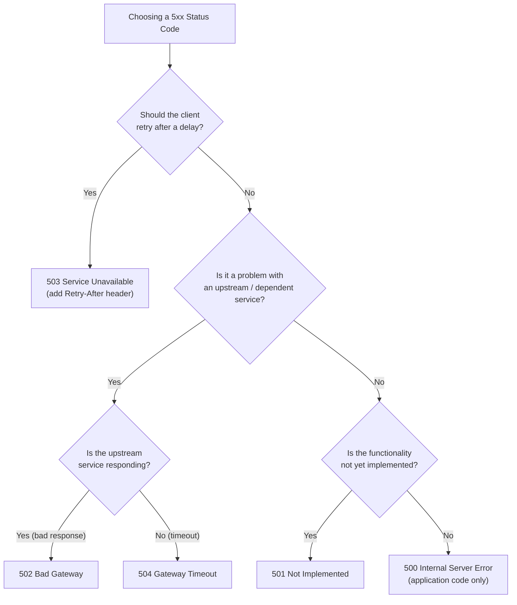

# HTTP Status Codes

**Category:** Design
**Tags:** status-codes, http, 2xx, 3xx, 4xx, 5xx, 200, 201, 204, 400, 401, 403, 404, 409, 422, 500

---

## Summary of Rules

- Status codes **MUST** be drawn from [RFC 9110](https://datatracker.ietf.org/doc/html/rfc9110) and [RFC 6585](https://datatracker.ietf.org/doc/html/rfc6585).
- The following status codes are excluded from use: `205`, `300`, `305`, `306`, `402`, `407`, `428`, `431`, `505`, `511`.
- For empty list results (e.g. a search that returns no matches), use `200` with an empty array — **not** `204` or `404`.
- Use `204` when the URL is valid and the entity exists but there is no content to return (e.g., a void PUT or POST response with no logical redirect).
- Use `404` when the entity referenced by the URL does not exist.
- Use `403` — not `404` — when the authenticated entity does not have permission to access a resource, **regardless of whether the resource actually exists**. This prevents enumeration attacks.
- Use `201` when a resource has been created as a result of a POST.
- Use `202` for accepted asynchronous requests (processing has not yet completed).
- Use `422` exclusively for JSON PATCH requests where the patch is syntactically valid but would result in an invalid resource state.
- Application code **MUST** respond with `500 Internal Server Error` for unhandled server errors. All other 5xx codes are intended for web servers, gateways, and load balancers.

---

## 2xx and 3xx Success & Redirect Codes



### Key 2xx Code Reference

| Code | Name | When to Use |
|------|------|------------|
| `200` | OK | Successful GET, successful POST query, empty list results |
| `201` | Created | Resource created via POST; include `Location` header and created resource ID |
| `202` | Accepted | Asynchronous request accepted; include `Location` header to status endpoint |
| `204` | No Content | Valid response with no body (e.g., void PUT/POST); entity exists but no content to return |
| `206` | Partial Content | Partial content delivery (web servers / range requests) |

### Key 3xx Code Reference

| Code | Name | When to Use |
|------|------|------------|
| `301` | Moved Permanently | Resource has permanently moved; method may change to GET |
| `302` | Found | Temporary redirect; method may change to GET |
| `303` | See Other | Redirect to a different resource (e.g., after POST creates a resource) |
| `304` | Not Modified | Conditional GET; cached response is still valid |
| `307` | Temporary Redirect | Temporary redirect; method and body must be preserved |
| `308` | Permanent Redirect | Permanent redirect; method and body must be preserved |

---

## 4xx Client Error Codes



### Key 4xx Code Reference

| Code | Name | When to Use |
|------|------|------------|
| `400` | Bad Request | Malformed request, invalid headers, invalid query parameters |
| `401` | Unauthorized | Authentication required or not provided; also for step-up auth requests |
| `403` | Forbidden | Authenticated but not authorised; also use when resource existence must not be revealed |
| `404` | Not Found | Resource does not exist at the given URI (not for permission denial) |
| `405` | Method Not Allowed | HTTP method not supported on this endpoint |
| `406` | Not Acceptable | Requested `Accept` type cannot be produced |
| `409` | Conflict | Request conflicts with current resource state (e.g. duplicate creation) |
| `410` | Gone | Resource permanently removed (use after soft delete or sunset) |
| `411` | Length Required | `Content-Length` header required |
| `412` | Precondition Failed | `If-Match` / `If-Unmodified-Since` condition failed |
| `415` | Unsupported Media Type | `Content-Type` not supported |
| `422` | Unprocessable Entity | PATCH only — valid body, but would result in invalid resource |
| `429` | Too Many Requests | Rate limit exceeded |

---

## 5xx Server Error Codes



### Key 5xx Code Reference

| Code | Name | When to Use |
|------|------|------------|
| `500` | Internal Server Error | Unhandled application error. **Application code MUST use this code only.** |
| `501` | Not Implemented | Requested functionality is not implemented |
| `502` | Bad Gateway | Upstream service returned an invalid response (gateway/proxy use) |
| `503` | Service Unavailable | Service temporarily unavailable; include `Retry-After` header |
| `504` | Gateway Timeout | Upstream service did not respond in time (gateway/proxy use) |

**Note:** `502`, `503`, and `504` are for web servers, gateways, and load balancers — **not** application code. Application code **MUST** only use `500`.

---

## Specific Scenarios

### 204 vs 404: Empty Results

| Situation | Correct Code |
|-----------|-------------|
| Collection query returns zero results | `200` with empty array `[]` |
| URL is valid, entity exists, no body content (void PUT/POST) | `204 No Content` |
| URL is valid but the entity does not exist | `404 Not Found` |

### 401 vs 403

| Situation | Correct Code |
|-----------|-------------|
| No authentication credentials provided | `401 Unauthorized` |
| Credentials provided, valid, but insufficient permissions | `403 Forbidden` |
| Resource exists but authenticated client has no access | `403 Forbidden` |
| Resource does not exist AND client should not know it exists | `403 Forbidden` (prevents enumeration) |

Always use `403` to prevent enumeration: mixing `403` and `404` based on resource existence allows attackers to determine which resources exist.

### 400 vs 404 for Invalid Parameters

| Parameter Type | Correct Code |
|---------------|-------------|
| Invalid **header** value | `400 Bad Request` |
| Invalid **query string** parameter | `400 Bad Request` |
| Invalid **path segment** (e.g. unknown tenant) | `404 Not Found` |

### 400 vs 409 for Duplicate Creation

If a POST would create a resource that already exists:
- Use `409 Conflict` (not `400 Bad Request`).
- Include a reason in the error body, e.g. `"An entity with that name already exists"`.

### 422 for JSON PATCH

- `422 Unprocessable Entity` is **exclusively** for PATCH requests.
- It signals that the PATCH document is syntactically valid, but applying it would leave the resource in an invalid state.
- Do not use `422` for other validation failures — use `400` instead.

### 201 and 202 with Location Header

- `201 Created`: Response **SHOULD** contain `Location` header pointing to the new resource, and the response body **SHOULD** include the created resource's identifier.
- `202 Accepted`: Response **SHOULD** contain `Location` header pointing to a status endpoint for checking progress. Body **SHOULD** be empty or contain a status identifier.

### Feature Unavailability

When a feature is unavailable for a specific tenant/region but exists for others, `404` is appropriate:

```
GET /entities/uk/123/premium-feature  → 200 (available in uk)
GET /entities/ie/456/premium-feature  → 404 (not available in ie)
```

`410 Gone` would be wrong here because it implies permanent removal — the feature may become available in future. `404` correctly signals that the resource does not exist at this path for this context.
