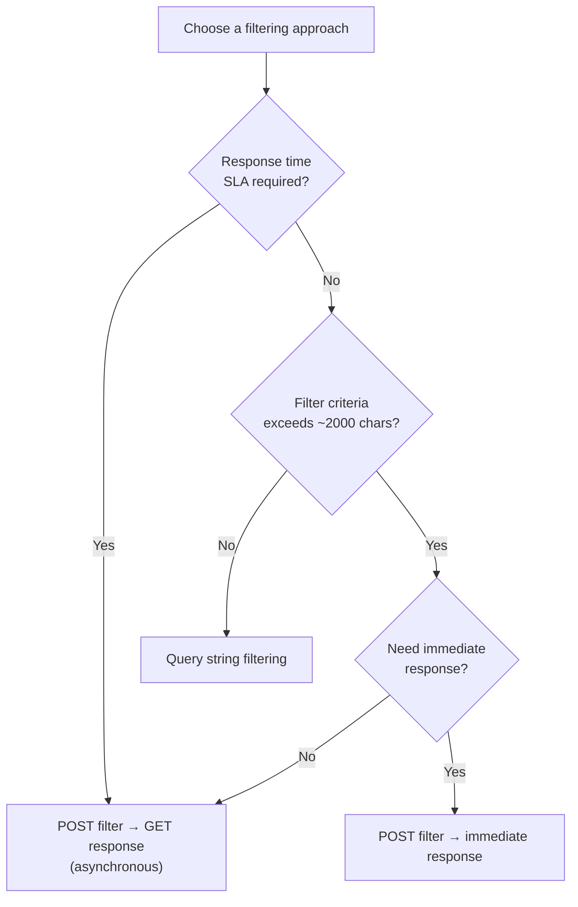

# Querying & Filtering

**Category:** Design
**Tags:** pagination, sorting, filtering, field-selection, count, cursor, offset, query-string

---

## Summary of Rules

### Pagination

- All collection endpoints **MUST** support pagination, even if not immediately required.
- Pagination requests **MUST** support a `limit` query parameter specifying the maximum number of records per page.
- Cursor pagination **SHOULD** be the preferred approach.
- Offset pagination **MAY** be used when the record set is small and cursor pagination would be unnecessary overhead.
- Offset pagination **MUST** use an `offset` query parameter (number of records/pages to skip).

### Sorting

- Sorting **MUST** be implemented using the `sortby` query string parameter.
- Multiple sort fields **MUST** be comma-separated (`,`) without spaces, in priority order.
- Fields **MUST** be prefixed with `+` for ascending order.
- Fields **MAY** be prefixed with `-` for descending order. Omitting a prefix defaults to descending order.
- Changing the default sort order **MAY** be considered a breaking change to clients.
- Sorting **SHOULD** only apply to fields present in the returned objects.

### Filtering

- Query string filtering **MUST** use field names directly (e.g. `name=bob`), not a generic `filter=` wrapper.
- Query string filtering operators **MUST** follow the defined syntax (see table below).
- Query string terms **MUST** be separated by `&`.
- Requests with SLA-bound response times **SHOULD** use POST filter pattern.
- Requests with filter criteria exceeding 2000 characters **SHOULD** use POST filter pattern.
- When using "POST filter, GET response", the `/status` endpoint **MUST** return one of: `Ready`, `Processing`, or `Error`.
- When using "POST filter, GET response", results endpoint **MUST** return `404` until results are ready.

### Field Selection

- Field selection **MUST** be implemented using the `select` query string parameter.
- Multiple fields **MUST** be comma-separated.
- The order of fields in the `select` parameter **SHOULD NOT** determine the order of fields in the response.

### Count

- Count **MUST** be implemented using the `count` query string parameter (no value, no equals sign).
- The response from a count request **MUST** be a single integer, regardless of other query parameters.
- Count **SHOULD NOT** be combined with sorting, paging, or field selection (these parameters will be ignored).
- Count **MAY** be combined with filtering.

---

## Pagination

### Offset Pagination

Specifies a page size and a number of records to skip.

```http
GET /items?limit=20&offset=3
```

This returns 20 records, skipping the first 60 (3 × 20) records.

**Advantages:**
- Simple to implement.
- Supports page-number UI patterns.
- Stateless and easy to scale.

**Disadvantages:**
- Performance degrades at high page numbers (database must skip records).
- Unstable when new records are inserted: pages shift, causing duplicate or missed records.
- Not efficient with key-value data stores.

### Cursor Pagination

The response for each page contains a cursor (typically the ID of the last record) used to fetch the next page.

```http
GET /items?limit=20&after=1234
```

This returns 20 records starting after record `1234`.

For bidirectional navigation:

```http
GET /items?limit=20&before=5678
```

**Response structure for cursor pagination:**

```json
{
  "data": [
    { "id": "1235", ... },
    { "id": "1236", ... }
  ],
  "paging": {
    "cursors": {
      "after": "1254",
      "before": "1235"
    }
  }
}
```

- `after`: cursor value representing the last record in the current page (use to get the next page).
- `before`: cursor value representing the first record in the current page (use to get the previous page).

**Rules:**
- The cursor value returned in the response **SHOULD** come from the API response — clients **MUST NOT** construct cursors independently.
- The cursor value **MUST** be understood by the receiving API.

**Advantages:**
- Provides consistent pages when new records are inserted.
- Each page load has the same performance.

**Disadvantages:**
- More complex to implement.
- Requires a unique, statically ordered identifier to use as cursor.
- Does not support random-access navigation (jumping to page 50) without added complexity.

---

## Sorting

```http
GET /items?sortby=name
GET /items?sortby=name,age
GET /items?sortby=-name,+age
```

| Syntax | Meaning |
|--------|---------|
| `sortby=name` | Sort by `name` descending (default) |
| `sortby=+name` | Sort by `name` ascending |
| `sortby=-name` | Sort by `name` descending |
| `sortby=+name,+age` | Sort by `name` ascending, then by `age` ascending |
| `sortby=-name,+age` | Sort by `name` descending, then by `age` ascending |

---

## Filtering

### Query String Filtering

Criteria are specified directly as query string parameters.

```http
GET /items?name=bob&ordercount>0
```

**Operator syntax:**

| Operator | Description | Example |
|----------|-------------|---------|
| `=` | Equal | `name=bob` |
| `<>` | Not equal | `name<>'jane jones'` |
| `>` | Greater than | `price>10.00` |
| `>=` | Greater than or equal | `age>=18` |
| `<` | Less than | `price<100.00` |
| `<=` | Less than or equal | `age<=13` |

**Placement:** Filter parameters **SHOULD** appear at the end of the query string, after all other parameters (e.g. `limit`, `sortby`).

**Advantages:**
- Simple to implement and use.
- Can be cached.

**Disadvantages:**
- URI length limit (~2000 characters) restricts complex filters.
- Long-running filters can exceed timeout limits.
- Cannot express logical OR without moving to POST.

### POST Filter → GET Response (Asynchronous)

For complex or long-running filters, POST the criteria and GET the results separately.

```http
POST /items/search
Content-Type: application/json

{ "filter": { "country": "DE", "status": "active", "tags": ["premium"] } }

→ 202 Accepted
  Location: /items/search/results/a1b2c3
```

Check status:

```http
GET /items/search/results/a1b2c3/status
→ 200 OK
  { "status": "Processing" }   ← or "Ready" or "Error"
```

Retrieve results when ready:

```http
GET /items/search/results/a1b2c3
→ 200 OK   (when Ready)
  { "data": [...] }

→ 404 Not Found   (when still Processing or not yet started)
```

**Status values:** `Ready`, `Processing`, `Error`.

**Advantages:**
- Works for arbitrarily complex filters.
- Response is immediate (link returned instantly).
- Results can be cached on the GET if the same criteria always produce the same link.

**Disadvantages:**
- Requires at least two API calls.
- More complex to implement.

### POST Filter → Immediate Response

POST the criteria and receive the filtered results immediately in the response.

```http
POST /items/search
Content-Type: application/json

{ "filter": { "country": "DE", "status": "active" } }

→ 200 OK
  { "data": [...] }
```

**Advantages:**
- Simple. One request, one response.
- Supports complex filter criteria (no URI length limit).

**Disadvantages:**
- Cannot be cached (POST responses are not cached by default).
- Long-running filters may timeout.

### Choosing a Filtering Approach



---

## Field Selection

Allows clients to request only specific fields, reducing payload size.

```http
GET /items?select=name
GET /items?select=name,age,email
```

The order of fields in the `select` parameter **SHOULD NOT** affect the order they appear in the response. Field ordering in the response is determined by the server.

**Note:** Each unique combination of selected fields must be cached separately — consider this when designing cache strategies.

---

## Count

Returns the total count of matching records without returning the records themselves.

```http
GET /items?count
GET /items?name=bob&count
```

Response is always a single integer:

```json
42
```

**Rules:**
- Use `count` without `=` (it is a flag, not a key-value parameter).
- `count` **MAY** be combined with filtering to count matching records.
- `count` **SHOULD NOT** be combined with `sortby`, `limit`, `offset`, or `select` — these parameters will be ignored.

---

## Combining Query Parameters

Query parameters may be combined. The standard precedence is:

```http
GET /items?limit=20&after=1234&sortby=+name&name=bob&select=id,name,age
```

This request:
1. Filters items where `name=bob`
2. Sorts by `name` ascending
3. Returns 20 items after cursor `1234`
4. Returns only `id`, `name`, and `age` fields

Filtering parameters **SHOULD** appear after pagination, sorting, and field-selection parameters in the query string.
