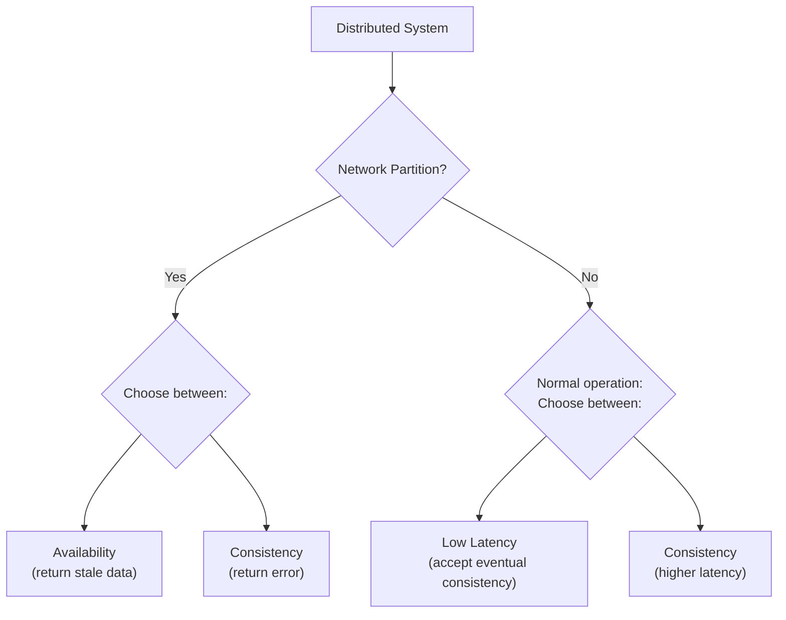
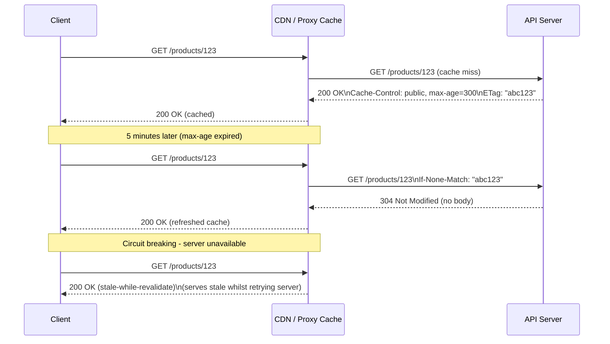

# Caching

**Category:** Design
**Tags:** caching, cache-control, etag, conditional-requests, http-caching, consistency, performance

---

## Summary of Rules

- A server **MUST** provide a `Cache-Control` header on all GET responses to indicate whether and how clients and intermediaries may cache the response.
- A server **MUST** specify whether clients should cache the data.
- A server **MUST** specify where clients may cache the data (private vs public).
- A server **MUST** specify how long clients should cache the data.
- A server **SHOULD** provide `Cache-Control` directives for revalidation (how to check for fresh versions).
- A server **MUST NOT** use both `Cache-Control` and `Expires` headers simultaneously.
- A server **MAY** use the `Expires` header instead of `Cache-Control` if it better suits requirements, but **MUST NOT** use both.
- A server **MAY** provide `ETag` or `Last-Modified` headers to enable conditional requests.

---

## Why Caching Matters

### CAP and PACELC Theorems

Two theorems guide caching decisions in distributed systems:

**CAP Theorem:** A distributed system must be Partition-tolerant, and during a network partition must choose between:
- **Availability** (return potentially stale data)
- **Consistency** (return an error if fresh data cannot be guaranteed)

**PACELC Theorem:** Extends CAP by noting that even under normal operation (no partition), if you prefer availability you must accept **latency** — the delay for all nodes to converge on the freshest version of the data.



### Caching in This Context

The "distributed system" includes all locations where a copy of the data may reside:
- API servers
- CDN edge caches
- Reverse proxy caches
- Browser caches
- Mobile device caches

Without explicit `Cache-Control` guidance, each layer makes its own caching decisions, leading to unpredictable behaviour. The server is the authoritative source and **MUST** express its caching intent.

---

## When to Choose Consistency vs Availability

| Data Type | Recommendation |
|-----------|---------------|
| Financial data, security credentials, access tokens | Prefer consistency (`no-store` or very short `max-age`) |
| User profile data, product catalogue | Accept eventual consistency (`max-age` with revalidation) |
| Static / immutable content (versioned assets) | Long cache + `immutable` |
| Real-time data (stock prices, live availability) | `no-store` or very short `max-age` |

For consistency-critical data, prefer:
- `no-store` to prevent caching entirely.
- Short `max-age` combined with `must-revalidate`.
- Server-side redundancy and client retry logic to improve availability without caching.

---

## Cache-Control Directives

The `Cache-Control` header controls caching behaviour for responses.

### Preventing Caching

```http
Cache-Control: no-store
```

Data **MUST NOT** be cached anywhere. Every request fetches a fresh copy.

### Controlling Cache Location

```http
Cache-Control: private
```
Only the end client (browser, mobile app) may cache this response. Shared intermediaries (reverse proxies, CDNs) **MUST NOT** cache it.

```http
Cache-Control: public
```
Any cache (CDN, proxy, browser) may store this response.

### Controlling Cache Duration

```http
Cache-Control: max-age=300
```
The response is considered fresh for 300 seconds (5 minutes). After this, it is stale.

```http
Cache-Control: stale-while-revalidate=60
```
After the response becomes stale, the client may continue serving the stale copy for up to 60 seconds **while** revalidating in the background.

### Controlling Revalidation Behaviour

```http
Cache-Control: must-revalidate
```
When the cached copy becomes stale, the client **MUST** successfully revalidate before using it again. It **MUST NOT** serve stale data if revalidation fails.

```http
Cache-Control: immutable
```
The response content will never change. Clients **MUST NOT** revalidate even after `max-age` expires. Use for versioned, content-addressed static assets.

---

## Common Cache-Control Patterns

**Do not cache at all:**
```http
Cache-Control: no-store
```

**Cache for 5 minutes; must revalidate before serving stale:**
```http
Cache-Control: max-age=300, must-revalidate
```

**Cache for 5 minutes; may continue serving stale indefinitely (eventual consistency):**
```http
Cache-Control: max-age=300
```

**Cache for 5 minutes; serve stale for up to 5 more minutes while revalidating; then must revalidate:**
```http
Cache-Control: max-age=300, stale-while-revalidate=300, must-revalidate
```

**Cache privately for 10 minutes:**
```http
Cache-Control: private, max-age=600
```

**CDN-cacheable for 1 hour; browser-private:**
```http
Cache-Control: public, max-age=3600
```

**Immutable static asset (e.g. versioned JS bundle):**
```http
Cache-Control: public, max-age=31536000, immutable
```

---

## ETag and Conditional Requests

ETags allow clients to check whether cached data is still valid without downloading the full response.

### How ETags Work

1. Server responds with an `ETag` header:
```http
HTTP/1.1 200 OK
Cache-Control: max-age=300
ETag: "abc123"

{ ... response body ... }
```

2. Client stores the ETag. When the cached response becomes stale, it sends a conditional request:
```http
GET /customers/123 HTTP/1.1
If-None-Match: "abc123"
```

3. Server checks whether the resource has changed:
- **Not changed:** Returns `304 Not Modified` (no body, reduces bandwidth).
- **Changed:** Returns `200 OK` with new body and new ETag.

### Last-Modified (Alternative to ETag)

```http
HTTP/1.1 200 OK
Last-Modified: Mon, 01 Jan 2024 12:00:00 GMT
```

Client conditional request:
```http
GET /customers/123 HTTP/1.1
If-Modified-Since: Mon, 01 Jan 2024 12:00:00 GMT
```

### Strong vs Weak ETags

| Type | Meaning | When to Use |
|------|---------|------------|
| **Strong** (default) | Response is byte-for-byte identical | Same content regardless of representation format |
| **Weak** (`W/"abc123"`) | Response is semantically equivalent but not byte-identical | Same content available in JSON and XML; both get the same weak ETag |

See [RFC 9110 §8.8.1](https://datatracker.ietf.org/doc/html/rfc9110#name-weak-versus-strong) for further detail.

---

## Multi-Version Caching

When a server returns different representations based on the `Accept` header (content-type negotiation), it **MUST** return a `Vary` header to prevent intermediary caches from returning the wrong version:

```http
HTTP/1.1 200 OK
Content-Type: application/json;v=2
Cache-Control: public, max-age=300
Vary: Accept
```

The `Vary: Accept` header tells caches to store separate entries for each unique `Accept` header value.

---

## Caching Architecture


