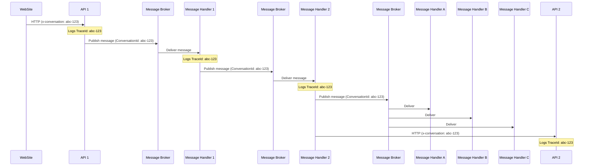

# Observability & Logging

**Category:** Operations
**Tags:** logging, observability, structured-logging, correlation-id, tracing, telemetry, gdpr

---

## Summary of Rules

- Services **MUST** use structured logging with a consistent schema to enable cross-service querying and filtering.
- Logs **MUST** include a correlation ID (trace ID) that spans the full request chain.
- The `x-conversation` header **MUST** be used for HTTP request correlation.
- The `Conversation` property **MUST** be used for internal message (event/queue) correlation.
- Services **MUST NOT** log GDPR-sensitive data (PII such as names, emails, national identifiers, financial details).
- Each service **SHOULD** log the request ID for every feature invocation.
- Each service **SHOULD** log trace headers (e.g. `x-trace-id`) from forwarded requests.
- Each service **SHOULD** log the tenant/context handling the request.
- Log entries **SHOULD** separate structured data from log messages (e.g. `Message: "Partner updated"` + `PartnerId: 123` rather than `Message: "Partner 123 updated"`).

---

## Why Structured Logging?

Structured logging attaches queryable key-value properties to each log event. This enables:
- Filtering log events by tenant, environment, feature, or error code without text parsing.
- Correlating events across multiple microservices using a shared trace ID.
- Low-cardinality properties (like `Feature`, `Environment`) that improve search index performance.

Compare unstructured vs structured:

| Approach | Log Message | Searchable? |
|----------|-------------|------------|
| Unstructured | `"Partner 123 updated in DE"` | Only by text search |
| Structured | `Message: "Partner updated"`, `PartnerId: "123"`, `Tenant: "de"` | Yes, by any field |

---

## Standard Log Schema

All log events **SHOULD** include the relevant subset of the following properties. Not all fields apply to every event; include what is relevant to the context.

### Core Fields

| Property | Type | Description |
|----------|------|-------------|
| `timestamp` | date | When the event occurred (UTC) |
| `version` | keyword | Schema version for the log format |
| `Level` | keyword | Log severity: `DEBUG`, `INFO`, `WARN`, `ERROR`, `FATAL` |
| `Message` | text | Human-readable description of the event |
| `MessageTemplate` | text | Template string used to generate Message |

### Service Context

| Property | Type | Description |
|----------|------|-------------|
| `Application` | keyword | Name of the service/application emitting the log |
| `Feature` | keyword | Feature or module within the application |
| `FeatureVersion` | keyword | Deployed version of the feature |
| `Environment` | keyword | Deployment environment: `dev`, `staging`, `production` |
| `InstanceId` | keyword | Identifier for the specific service instance |
| `Hostname` | keyword | Host or container running the service |
| `Team` | keyword | Owning team |

### Request Context

| Property | Type | Description |
|----------|------|-------------|
| `TraceId` | keyword | Distributed trace ID spanning the full request chain |
| `HttpMethod` | keyword | HTTP method: `GET`, `POST`, etc. |
| `HttpStatus` | keyword | HTTP response status code |
| `request_uri` | keyword | The request URI (path + query) |
| `request_method` | keyword | HTTP method (alternative field) |
| `request_time` | long | Request processing time in milliseconds |
| `ResponseStatusCode` | keyword | HTTP response status code (alternative field) |
| `UserAgent` | text | Client user agent string |
| `ipAddress` | keyword | Client IP address |

### Error Context

| Property | Type | Description |
|----------|------|-------------|
| `ErrorCode` | long | Application-defined error code |
| `ErrorType` | keyword | Category of error |
| `Exception` | keyword | Exception details (never include stack traces in production) |
| `ExceptionMessage` | keyword | Exception message (sanitised — no PII, no internal details) |
| `ExceptionName` | keyword | Exception class name |
| `ExceptionType` | keyword | Exception type |
| `error_json` | keyword | Serialised error object (sanitised) |

### Event Context

| Property | Type | Description |
|----------|------|-------------|
| `Event` | keyword | Named event identifier |
| `EventId_Id` | keyword | Event ID |
| `EventTime` | keyword | When the business event occurred |
| `LogType` | keyword | Type of log entry (e.g. `request`, `event`, `audit`) |
| `MessageType` | keyword | Type of message being logged |

### Infrastructure Context

| Property | Type | Description |
|----------|------|-------------|
| `Database` | keyword | Database name or identifier |
| `AvailabilityZone` | keyword | Availability zone or region |
| `Tier` | integer | Service tier |
| `HealthStatus` | keyword | Health status of the service |
| `is_beta` | boolean | Whether this is a beta deployment |
| `IsEnabled` | boolean | Whether this feature is enabled |

### Geolocation (optional)

| Property | Type | Description |
|----------|------|-------------|
| `geoip.country_code2` | keyword | ISO 3166-1 alpha-2 country code |
| `geoip.country_name` | keyword | Country name |
| `geoip.city_name` | keyword | City name |
| `geoip.continent_code` | keyword | Continent code |
| `geoip.timezone` | keyword | Timezone for this IP |
| `geolocation` | geo_point | Geographic coordinates |

---

## Correlation IDs

To trace a request through multiple services (distributed tracing), every service **MUST** propagate a shared correlation identifier.

### HTTP Requests

Use the `x-conversation` header to pass the correlation ID between services over HTTP:

```http
GET /orders/123 HTTP/1.1
x-conversation: a1b2c3d4-e5f6-7890-abcd-ef1234567890
```

When a service receives a request with this header, it **MUST**:
1. Extract the `x-conversation` value.
2. Log it as `TraceId` in all log entries for this request.
3. Forward it in any downstream HTTP requests.

### Internal Messages (Events / Queues)

When a service publishes a message to a message broker (e.g. event bus, queue), include the correlation ID as a `ConversationId` property on the message:

```json
{
  "type": "OrderCreated",
  "payload": { ... },
  "metadata": {
    "conversationId": "a1b2c3d4-e5f6-7890-abcd-ef1234567890"
  }
}
```

Downstream message consumers **MUST** extract and log the `conversationId` as `TraceId`.

### Telemetry Chain

The following diagram illustrates how the correlation ID (`x-conversation` / `ConversationId`) flows through a typical request chain involving both HTTP calls and internal messaging:



By the time the final consumers handle messages, you can query logs with `TraceId: abc-123` and see the complete chain of events from the originating HTTP request.

---

## Common Items to Log

### Every Request

```
RequestId:     unique identifier for this request
TraceId:       x-conversation header value (or generated if not present)
Tenant:        the tenant context of the request
HttpMethod:    GET, POST, etc.
request_uri:   full URI (sanitised — no secrets in query strings)
HttpStatus:    response status code
request_time:  total request duration
```

### Forwarded Requests

When your service receives requests forwarded from an upstream service:

```
TraceId:   value from x-trace-id or x-conversation header
```

### Error Events

```
ErrorCode:        application error code
ErrorType:        category of error
ExceptionMessage: sanitised error message (no PII, no stack traces in production)
HttpStatus:       response status code
```

---

## GDPR and Privacy Compliance

Logs **MUST NOT** contain GDPR-sensitive data:

- Personal names
- Email addresses
- Phone numbers
- National identifiers (passport, NI, SSN, etc.)
- Financial data (account numbers, card numbers)
- Health data
- Location data that can identify individuals

If you need to correlate logs with a specific user, log a **pseudonymous identifier** (e.g. an internal user ID or tenant ID) rather than PII.

---

## Observability Platform Considerations

This documentation is platform-agnostic. The structured log schema above is compatible with any observability platform that supports structured / JSON logging, including:

- OpenTelemetry-compatible collectors
- ELK / OpenSearch stack
- Cloud-native logging services
- Structured logging libraries (e.g. Serilog, Winston, structlog)

Regardless of the platform, the key requirements are:
1. Logs are **structured** (key-value pairs, not free text).
2. Each log entry has a **TraceId** for cross-service correlation.
3. Log levels are consistent (`DEBUG`, `INFO`, `WARN`, `ERROR`, `FATAL`).
4. PII is excluded from all log entries.
