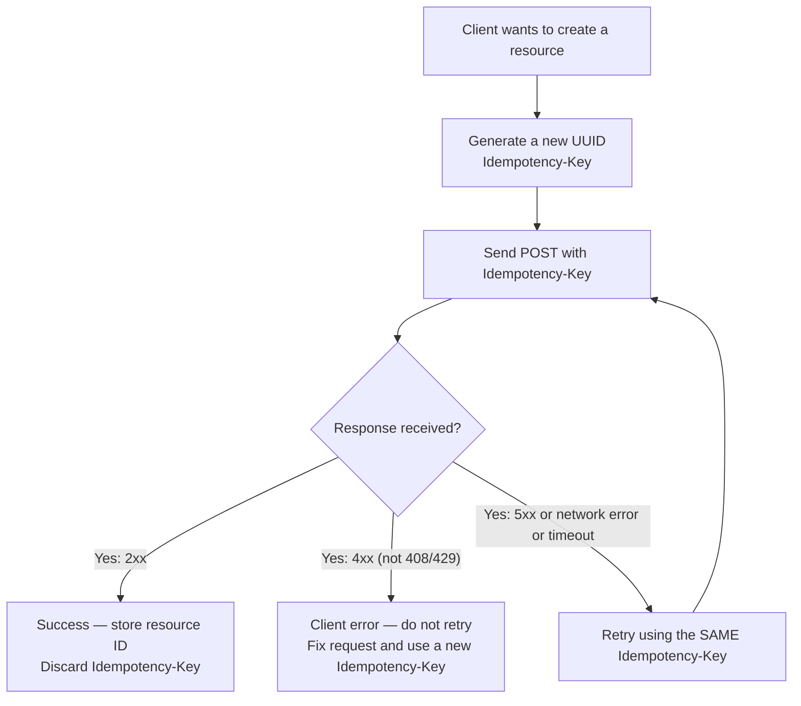

# Idempotency

**Category:** Design
**Tags:** idempotency, idempotency-key, retries, safe-retries, duplicate-prevention, consistency

---

## Summary of Rules

- Non-idempotent operations that are safe to retry **SHOULD** support the `Idempotency-Key` header.
- The `Idempotency-Key` header **MUST** be a client-generated UUID.
- If a server receives a request with an `Idempotency-Key` it has already processed, it **MUST** return the original response without re-executing the operation.
- Idempotency key storage **SHOULD** be retained for at least 24 hours.
- Idempotency keys **MUST NOT** be reused across different operations or resources.
- If two requests with the same `Idempotency-Key` differ in request body content, the server **MUST** return `422 Unprocessable Entity`.
- The server **SHOULD** include the `Idempotency-Key` in the response so clients can confirm the key was accepted.
- All GET, PUT, and DELETE operations are inherently idempotent and do not require `Idempotency-Key`.

---

## What is Idempotency?

An operation is idempotent if calling it once or N times produces the same result. From [HTTP Verbs](./05-http-verbs.md):

| Method | Idempotent? |
|--------|------------|
| `GET` | ✅ Yes |
| `PUT` | ✅ Yes (when guaranteed) |
| `DELETE` | ✅ Yes |
| `POST` | ❌ No |
| `PATCH` | ❌ No (unless implemented idempotently) |

**The problem:** Networks are unreliable. When a client sends a POST to create a resource and receives a network error (no response), it cannot know whether the server processed the request. Retrying without idempotency protection may create duplicate resources.

**The solution:** An `Idempotency-Key` allows a client to safely retry a request. The server uses the key to detect duplicate requests and return the original response instead of re-executing the operation.

---

## The Idempotency-Key Header

The client generates a unique key before making the request and attaches it to the `Idempotency-Key` header.

```http
POST /orders HTTP/1.1
Authorization: Bearer eyJ...
Content-Type: application/json
Idempotency-Key: 550e8400-e29b-41d4-a716-446655440000

{
  "customerId": "cust_abc123",
  "items": [
    { "productId": "prod_xyz", "quantity": 2 }
  ]
}
```

**First call (new key):** The server processes the request normally and returns `201 Created`.

**Retry (same key, same body):** The server recognises the key, skips execution, and returns the stored `201 Created` response.

```http
HTTP/1.1 201 Created
Location: /orders/ord_789
Idempotency-Key: 550e8400-e29b-41d4-a716-446655440000
Content-Type: application/json

{
  "id": "ord_789",
  "status": "pending"
}
```

---

## Server Behaviour

### On First Receipt of a Key

1. Check whether the key has been seen before. If not, continue.
2. Lock the key (to prevent concurrent duplicate processing).
3. Execute the operation.
4. Store the result (status code + response body) associated with the key.
5. Return the result to the client.

### On Subsequent Receipt of the Same Key

1. Retrieve the stored result for this key.
2. Return it unchanged — **do not** re-execute the operation.

### Conflicting Bodies

If the same key is received with a different request body, return an error:

```http
HTTP/1.1 422 Unprocessable Entity
Content-Type: application/json

{
  "fault": {
    "faultId": "abc-123",
    "traceId": "xyz-456",
    "errors": [
      {
        "errorCode": "IDEMPOTENCY_CONFLICT",
        "description": "An Idempotency-Key may not be reused with a different request body."
      }
    ]
  }
}
```

### Concurrent Requests with the Same Key

When two requests with the same key arrive simultaneously (before the first has completed), the second request **SHOULD** receive `409 Conflict` with guidance to retry after a short delay.

---

## Key Expiry

Idempotency keys are transient; they are not permanent identifiers.

- Keys **SHOULD** be retained for at least **24 hours** after the initial request.
- After expiry, a request with the same key is treated as a new request.
- The retention period **SHOULD** be documented in the API so clients know how long they can safely retry.

---

## Client Responsibilities



**Rules for clients:**
- Generate the key **before** sending the request, not after a failure.
- **Reuse the same key** on retries for the same logical operation.
- Generate a **new key** for each new logical operation (even if the request body is identical).
- Do not reuse keys across different endpoints or resources.
- Implement exponential backoff between retries.

---

## When to Support Idempotency Keys

Support `Idempotency-Key` on POST endpoints where:

| Scenario | Recommended? |
|----------|-------------|
| Creating a resource with significant side effects (payment, order, booking) | **Yes — strongly recommended** |
| Triggering an asynchronous operation | **Yes — recommended** |
| Sending a notification or email | **Yes — recommended** |
| Creating a resource with no side effects (adding a tag, a comment) | Optional |
| Queries (POST returning 200) | Not applicable — no state change |

GET, PUT, and DELETE are inherently idempotent and do not require this header.

---

## OpenAPI Declaration

```yaml
paths:
  /orders:
    post:
      summary: Create order
      parameters:
        - name: Idempotency-Key
          in: header
          required: false
          description: |
            A client-generated UUID used to safely retry the request.
            If a request with this key has already been processed, the server returns
            the original response without re-executing the operation.
            The key is valid for 24 hours.
          schema:
            type: string
            format: uuid
          example: "550e8400-e29b-41d4-a716-446655440000"
```

---

## Relationship to PUT

`PUT` is already idempotent by definition — calling it multiple times with the same body leaves the resource in the same state. Idempotency keys are therefore not needed for PUT.

However, if a PUT implementation has side effects that break idempotency (e.g. it publishes an event each time it is called), then PUT **MUST NOT** be used — use POST or PATCH instead, and support `Idempotency-Key` on that endpoint.

See [HTTP Verbs](./05-http-verbs.md) for idempotency rules on each method.
