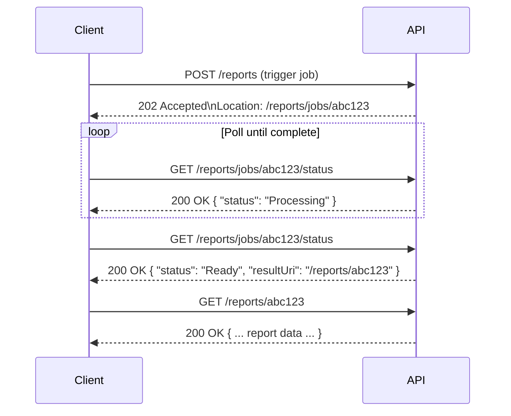
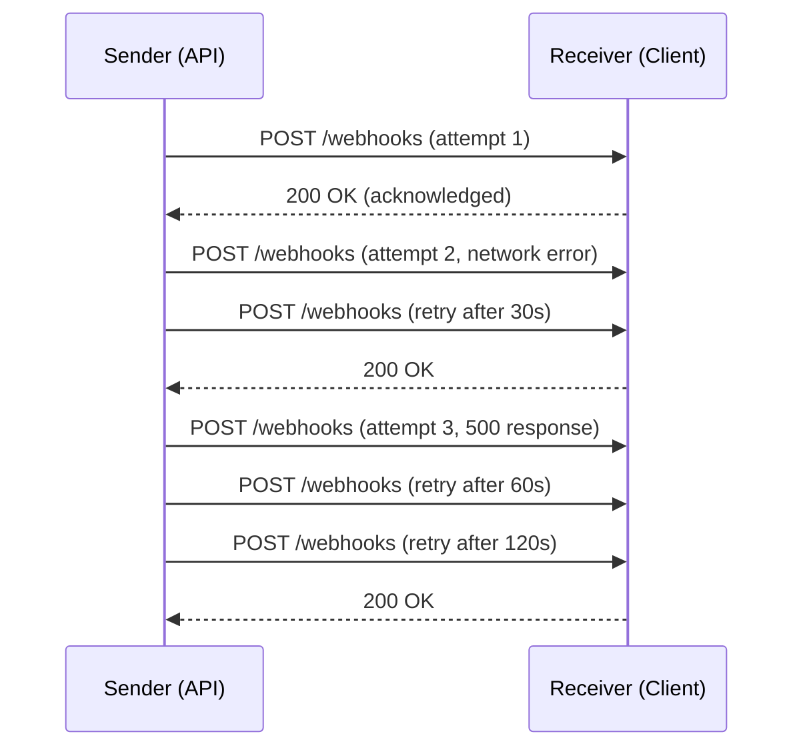
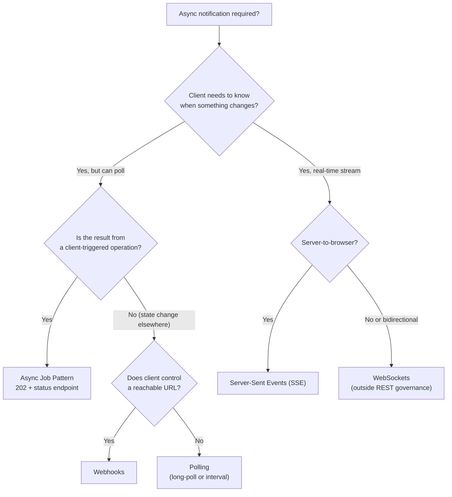

# Webhooks & Async Patterns

**Category:** Design
**Tags:** webhooks, async, callbacks, event-driven, long-running, polling, server-sent-events, push, delivery, retry

---

## Summary of Rules

### Webhooks
- Webhook payloads **MUST** include an event type, a unique event ID, and a timestamp.
- Webhook delivery **MUST** be retried with exponential backoff on non-2xx responses or connection failures.
- Webhooks **MUST** be signed; receivers **MUST** verify the signature before processing the payload.
- Webhook signatures **MUST** use HMAC-SHA256 with a shared secret.
- Receivers **SHOULD** respond to webhook delivery within 5 seconds; long processing **MUST** be deferred asynchronously.
- Receivers **SHOULD** implement idempotency using the event ID to handle duplicate deliveries.
- Webhook endpoints **MUST** return `200 OK` (or any 2xx) to acknowledge delivery. Any other status triggers a retry.
- Webhook payloads **SHOULD NOT** include complete resource state; they **SHOULD** include the resource ID so receivers can fetch current state if needed.

### Asynchronous Job Pattern
- Asynchronous operations **MUST** return `202 Accepted` with a `Location` header pointing to a status endpoint (see [HTTP Status Codes](./06-http-status-codes.md)).
- The status endpoint **MUST** be accessible by `GET` and **MUST** return the current job state.
- Completed jobs **SHOULD** include the result resource URI in the status response.

### Polling
- When a client must poll for results, the status endpoint **SHOULD** include a `Retry-After` header to guide polling frequency.
- Excessive polling **SHOULD** be rate-limited per client.

---

## Asynchronous Job Pattern

When an operation cannot complete within a reasonable HTTP timeout (typically < 30 seconds), the request is accepted immediately and processing happens in the background.

### Flow



### Step 1: Trigger

```http
POST /reports HTTP/1.1
Authorization: Bearer eyJ...
Content-Type: application/json

{
  "type": "monthly-sales",
  "from": "2024-01-01",
  "to": "2024-01-31",
  "tenantId": "uk"
}
```

```http
HTTP/1.1 202 Accepted
Location: /reports/jobs/abc123
Content-Type: application/json

{
  "jobId": "abc123",
  "status": "Queued"
}
```

### Step 2: Status Endpoint

```http
GET /reports/jobs/abc123/status HTTP/1.1
Authorization: Bearer eyJ...
```

```http
HTTP/1.1 200 OK
Content-Type: application/json
Retry-After: 10

{
  "jobId": "abc123",
  "status": "Processing",
  "createdAt": "2024-07-23T10:30:00Z",
  "updatedAt": "2024-07-23T10:30:05Z"
}
```

**Status values:**

| Status | Meaning |
|--------|---------|
| `Queued` | Request received; work has not started yet. |
| `Processing` | Work is in progress. |
| `Ready` | Processing complete; result is available. |
| `Error` | Processing failed; see `errors` array. |

When `Ready`:

```http
HTTP/1.1 200 OK
Content-Type: application/json

{
  "jobId": "abc123",
  "status": "Ready",
  "resultUri": "/reports/abc123",
  "createdAt": "2024-07-23T10:30:00Z",
  "completedAt": "2024-07-23T10:30:45Z"
}
```

When `Error`:

```http
HTTP/1.1 200 OK
Content-Type: application/json

{
  "jobId": "abc123",
  "status": "Error",
  "errors": [
    {
      "errorCode": "REPORT_DATE_RANGE_TOO_LARGE",
      "description": "The requested date range exceeds the maximum of 90 days."
    }
  ]
}
```

### Step 3: Retrieve Results

```http
GET /reports/abc123 HTTP/1.1
Authorization: Bearer eyJ...
```

```http
HTTP/1.1 200 OK
Content-Type: application/json

{
  "id": "abc123",
  "type": "monthly-sales",
  "data": [ ... ]
}
```

The results endpoint **MUST** return `404 Not Found` if the job has not reached `Ready` status. It **SHOULD NOT** block.

---

## Webhooks

Webhooks allow a server to push event notifications to a client-registered URL when something interesting happens, instead of requiring the client to poll.

### Event Payload Structure

Every webhook event **MUST** include:

```json
{
  "eventId": "evt_7f3a2b1c-d4e5-6f7a-8b9c-0d1e2f3a4b5c",
  "eventType": "order.created",
  "occurredAt": "2024-07-23T10:30:00Z",
  "apiVersion": "2024-07-23",
  "data": {
    "id": "ord_789",
    "customerId": "cust_123",
    "status": "pending"
  }
}
```

| Field | Required | Description |
|-------|----------|-------------|
| `eventId` | **Yes** | Unique identifier for this event. Clients use this for deduplication. UUID format. |
| `eventType` | **Yes** | Dot-separated event name: `{resource}.{action}` (e.g. `order.created`, `customer.updated`). |
| `occurredAt` | **Yes** | ISO 8601 UTC timestamp of when the event occurred. |
| `apiVersion` | **Yes** | The API version used to generate the payload (date-based or semver). |
| `data` | **Yes** | The event data. See below. |

### Data Payload — Thin Events Preferred

Payloads **SHOULD** be "thin": include the resource ID and key changed fields, but not the complete resource state.

**Why thin events?**
- Avoids serialising sensitive data to external systems.
- Prevents race conditions where the payload is stale by the time it is processed.
- Keeps webhook delivery fast; receivers fetch full state only when needed.

```json
{
  "eventType": "order.status.updated",
  "data": {
    "orderId": "ord_789",
    "previousStatus": "pending",
    "newStatus": "dispatched",
    "updatedAt": "2024-07-23T11:00:00Z"
  }
}
```

If the receiver needs full resource state, they call `GET /orders/ord_789` using the included ID.

### Webhook Signatures

To prevent malicious actors from forging webhook payloads, all deliveries **MUST** be signed.

**Signature scheme:** HMAC-SHA256 over the raw request body, using a shared secret known only to sender and receiver.

**Request headers:**

```http
POST /webhooks/orders HTTP/1.1
Content-Type: application/json
x-signature-256: sha256=3c47b5e1f6e3c4d1a8b9f2e0d7c6b5a4938271605f4e3d2c1b0a9f8e7d6c5b4
x-timestamp: 1721734200
```

**Signature construction:**

```
signed_payload = timestamp + "." + raw_body
signature = HMAC-SHA256(shared_secret, signed_payload)
header_value = "sha256=" + hex(signature)
```

**Verification steps (receiver):**

1. Extract `x-timestamp` and `x-signature-256` from the request headers.
2. Reject requests where the timestamp is more than 5 minutes old (prevents replay attacks).
3. Reconstruct the signed payload: `timestamp + "." + raw_body`.
4. Compute HMAC-SHA256 using the shared secret.
5. Compare using a timing-safe string comparison.
6. Reject the request if signatures do not match.

### Delivery and Retry



**Delivery rules:**
- The sender **MUST** retry delivery on any non-2xx response or connection failure.
- Retries **MUST** use exponential backoff (e.g. 30s, 60s, 120s, 300s, ...).
- Retries **SHOULD** include jitter to prevent thundering herd.
- Delivery **SHOULD** be attempted for at least **72 hours** before marking as failed.
- The receiver **MUST** respond within **5 seconds**. Long processing **MUST** be handled asynchronously (e.g. enqueue internally, then acknowledge immediately).

**Suggested retry schedule:**

| Attempt | Delay |
|---------|-------|
| 1 | Immediate |
| 2 | 30 seconds |
| 3 | 2 minutes |
| 4 | 10 minutes |
| 5 | 1 hour |
| 6+ | 6 hours (up to 72 hours total) |

### Receiver Idempotency

Because delivery may be retried, receivers **MUST** handle duplicate events gracefully:

1. Extract `eventId` from the payload.
2. Check whether this `eventId` has already been processed.
3. If yes: return `200 OK` immediately without reprocessing.
4. If no: process the event, record the `eventId` as processed, then return `200 OK`.

### Webhook Registration

Webhook subscriptions **SHOULD** be managed via API:

```http
POST /webhook-subscriptions HTTP/1.1
Content-Type: application/json

{
  "url": "https://partner.example.com/webhooks/orders",
  "events": ["order.created", "order.status.updated"],
  "secret": "my-shared-secret"
}
```

```http
HTTP/1.1 201 Created
Location: /webhook-subscriptions/sub_abc123
```

Subscriptions **SHOULD** support:
- Listing active subscriptions.
- Updating the target URL or event list.
- Deleting (unsubscribing).
- Testing delivery (trigger a synthetic test event).

---

## Choosing an Async Pattern



| Pattern | Best For | Drawbacks |
|---------|---------|----------|
| **Async Job + Polling** | Client-triggered long-running operations | Client must poll; inefficient for high frequency |
| **Webhooks** | Event notifications to partner or backend systems | Requires client to host a reachable HTTPS endpoint |
| **Server-Sent Events (SSE)** | Server-to-browser real-time streams | One-directional; not suited to mobile or high-latency networks |
| **WebSockets** | Bidirectional real-time communication | Higher complexity; outside REST governance scope |

---

## Event Type Naming

Event types **MUST** follow a dot-separated `{resource}.{action}` convention:

```
order.created
order.status.updated
order.cancelled
customer.updated
customer.deleted
payment.succeeded
payment.failed
shipment.dispatched
```

**Rules:**
- Use past tense for state-change events: `order.created`, not `order.create`.
- Use present state for current-state events: `payment.failed` (the payment is in a failed state).
- Use noun segments (not verbs) for the resource portion.
- Use lowercase with dots as separators.
